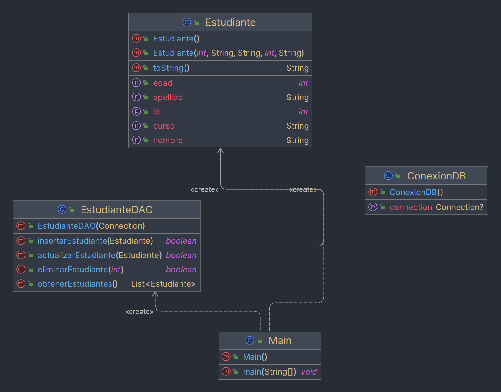

# Tarea UD2 Actividad JDBC  💻
*Autor:*

- Guillermo Callizaya Fernández

### Descripción:

Desarrolla una pequeña aplicación en Java usando JDBC para administrar un registro de estudiantes. La aplicación deberá permitir las operaciones CRUD básicas: Crear, Leer, Actualizar y Eliminar registros de estudiantes.

### Entregables:


1. Código fuente:

- Incluye todos los archivos de tu proyecto, ordenados y comentados.


2. Video explicativo:

- Deberás grabar un video donde expliques el código desarrollado y demuestres el funcionamiento de tu aplicación.

- Se evaluará tu capacidad para explicar los conceptos técnicos involucrados.


3. Documentación técnica:

- Descripción general de la aplicación.

- Diagrama de clases y/o estructura del proyecto.

- Instrucciones de instalación y configuración (incluyendo la base de datos).

- Explicación detallada de cómo se establece la conexión JDBC y se realizan las operaciones CRUD.


4. Referencias:

- Lista de fuentes y recursos consultados durante la elaboración del proyecto.


#### Descripción general de la app
La aplicación es un sistema de gestión de estudiantes diseñado para realizar operaciones CRUD (Crear, Leer, Actualizar, Eliminar) en una base de datos MySQL. La interfaz basada en consola facilita estas operaciones, permitiendo a los usuarios interactuar fácilmente con los registros de estudiantes.


### Diagrama de Clases y Estructura del Proyecto

El proyecto está estructurado en cuatro clases principales, cada una con una responsabilidad específica dentro de la aplicación:

1. **Clase `Main`**:
    - **Función**: Gestiona la interacción del usuario con la aplicación.
    - **Características**: Contiene el método `main` y un menú interactivo que permite a los usuarios elegir entre distintas operaciones CRUD.
    - **Relación con otras clases**: Interactúa directamente con `EstudianteDAO` para realizar operaciones CRUD.

2. **Clase `Estudiante`**:
    - **Función**: Representa la entidad "Estudiante".
    - **Características**: Contiene propiedades como `id`, `nombre`, `apellido`, `edad` y `curso`, junto con sus respectivos métodos getter y setter.
    - **Uso**: Utilizada por `EstudianteDAO` para representar los datos que se manipulan en la base de datos.

3. **Clase `EstudianteDAO` (Data Access Object)**:
    - **Función**: Contiene la lógica para las operaciones CRUD en la base de datos.
    - **Características**: Métodos como `insertarEstudiante`, `obtenerEstudiantes`, `actualizarEstudiante`, y `eliminarEstudiante`.
    - **Relación con otras clases**: Utiliza `ConexionDB` para establecer la conexión con la base de datos y `Estudiante` para manejar los datos.

4. **Clase `ConexionDB`**:
    - **Función**: Gestiona la conexión con la base de datos.
    - **Características**: Proporciona un método estático `getConnection` que utiliza `DriverManager` para conectarse a MySQL.
    - **Relación con otras clases**: Es utilizada por `EstudianteDAO` para obtener la conexión necesaria para las operaciones de la base de datos.



Instrucciones de Instalación y Configuración

Requisitos previos:

* Instalar Java Development Kit (JDK) versión 8 o superior.

* Instalar un servidor de base de datos MySQL.

* Instalar una herramienta como phpMyAdmin para gestionar la base de datos MySQL de manera gráfica (opcional pero recomendado).

* Instalar un IDE que soporte Maven, como IntelliJ IDEA.

Pasos:

-Configurar la base de datos:
*    Accede a MySQL a través de la línea de comandos o phpMyAdmin.
*    Crea una nueva base de datos llamada db_estudiantes.
*    Dentro de esta base de datos, crea una tabla estudiantes con los campos id, nombre, apellido, edad, curso.

-Configurar el entorno de desarrollo:
* Clona el repositorio de código o descarga el proyecto en tu sistema local.
* Abre el proyecto en tu IDE.
* Si el proyecto utiliza Maven, el IDE debería detectar el archivo pom.xml y descargar automáticamente las dependencias necesarias.

-Configurar la conexión a la base de datos:
* En la clase ConexionDB, establece los valores de las constantes URL, USER= root y PASSWORD= "", para que coincidan con tu configuración de MySQL.

-Compilar y ejecutar la aplicación:
* Utiliza el sistema de construcción integrado en tu IDE para compilar el proyecto.
* Ejecuta la aplicación desde el IDE o desde la línea de comandos.

-Uso de la aplicación:
* Interactúa con el menú de consola para realizar operaciones CRUD en la base de datos de estudiantes.

### Explicación detallada de la conexión JDBC y operaciones CRUD

**Conexión JDBC:**
La conexión a la base de datos se realiza mediante JDBC, que es una API de Java para conectar y ejecutar operaciones en bases de datos.

- **DriverManager**: Esta clase intenta establecer una conexión utilizando la URL de la base de datos, el nombre de usuario y la contraseña proporcionados.
- **URL**: Una cadena de conexión que define el protocolo JDBC, el servidor, el puerto y la base de datos a la que se conectará.
- **USER y PASSWORD**: Credenciales necesarias para la autenticación en el servidor de base de datos.

```java
/*
public static Connection getConnection() {
    try {
        return DriverManager.getConnection(URL, USER, PASSWORD);
    } catch (Exception e) {
        // Manejo de excepciones
    }
}
*/
 
```

**Operaciones CRUD:**
- **Crear (Insertar)**: Se utiliza un `PreparedStatement` para insertar los datos en la base de datos, lo que ayuda a prevenir inyecciones SQL.
- **Leer (Consultar)**: Se utiliza un objeto `Statement` para ejecutar una consulta `SELECT` y obtener datos, que luego se mapean a objetos `Estudiante`.
- **Actualizar**: Similar a crear, pero con una sentencia SQL `UPDATE` para modificar datos existentes.
- **Eliminar**: Se usa `DELETE` con un `PreparedStatement` para eliminar un registro basado en un ID dado.

El patrón DAO (Data Access Object) encapsula estas operaciones CRUD, lo que significa que cada operación está contenida dentro de métodos específicos en la clase `EstudianteDAO`, permitiendo que la lógica de acceso a datos esté separada de la lógica de negocio principal de la aplicación.